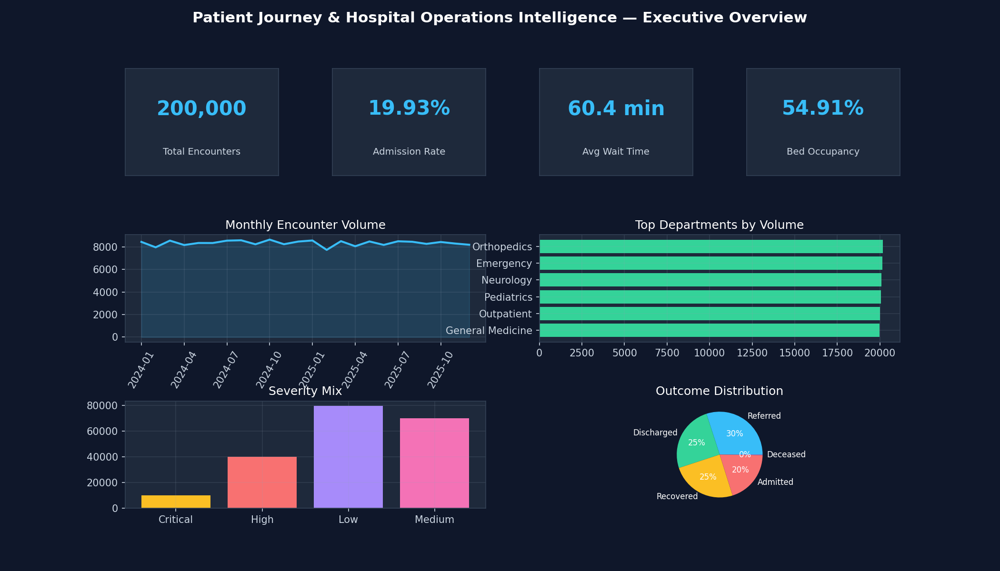
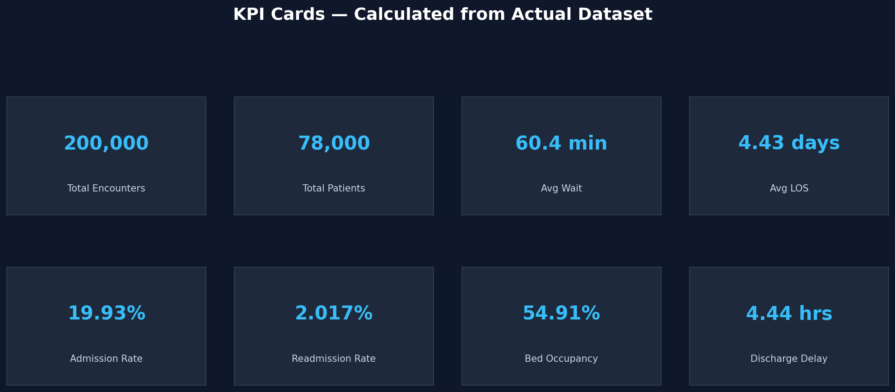
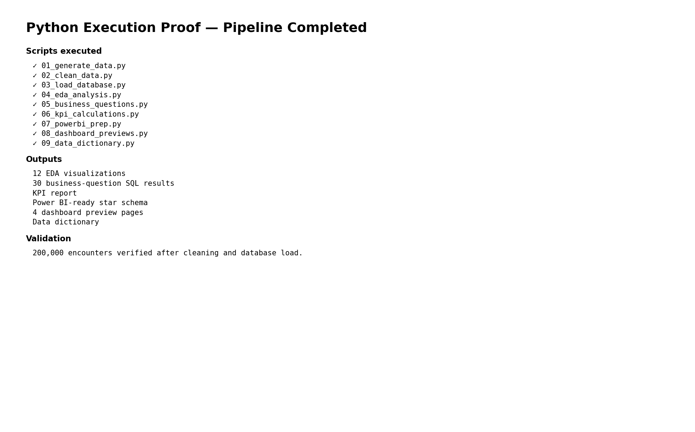
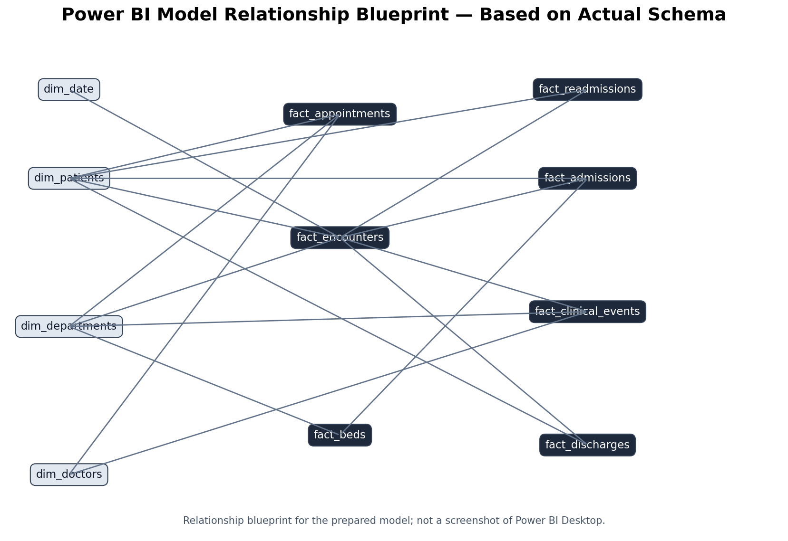
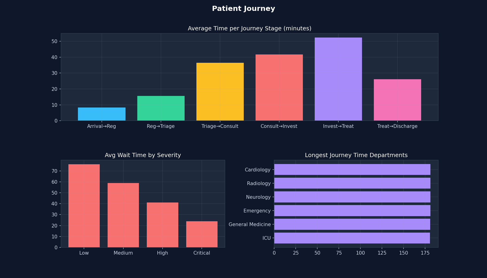
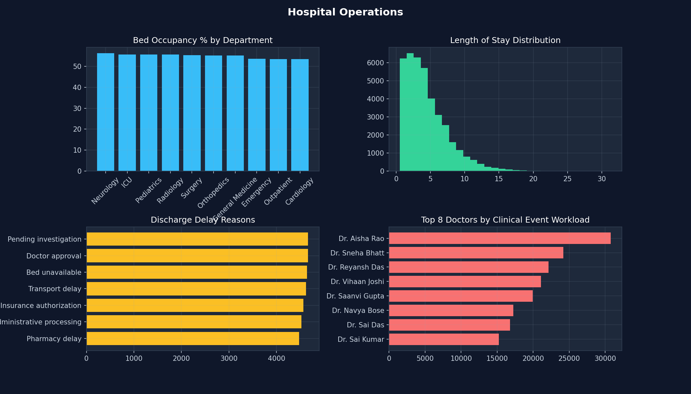
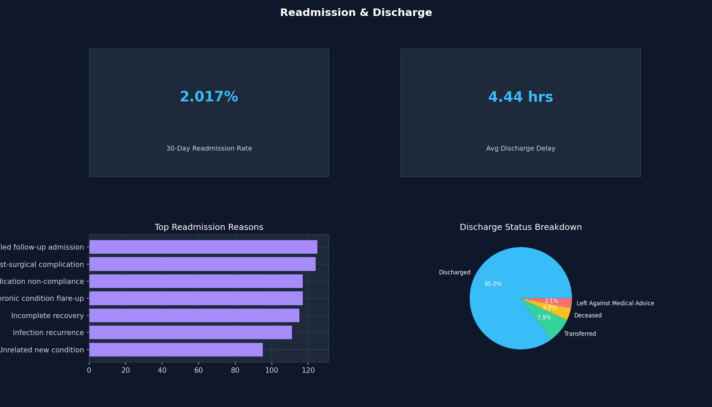
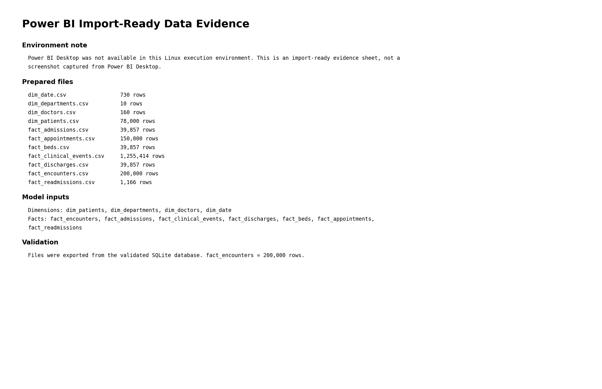

# Patient Journey and Hospital Operations Intelligence

> **End-to-end Data Analytics research project using 200,000 synthetic patient encounters to study patient flow, waiting time, hospital operations, Length of Stay, bed utilization, discharge delays, appointments and readmissions.**



## Project at a Glance

| Item | Value |
|---|---:|
| Patient encounters | **200,000** |
| Core relational tables | **10** |
| Business questions | **30** |
| EDA visualizations | **12** |
| Dashboard pages | **4** |
| SQL execution proofs | **30** |
| Primary database | SQLite |
| Main tools | Python, Pandas, NumPy, SQL, Power BI-ready model |

## Project Overview

Hospitals generate large amounts of operational data across registration, triage, consultation, admissions, discharge, appointments and bed activity. Looking at these activities separately makes it difficult to see where patients wait, where capacity is under pressure, and which operational processes need attention.

This project builds a single analytics workflow around the patient journey:

**Arrival → Registration → Triage → Consultation → Investigation → Treatment → Admission → Discharge → Readmission**

The analysis focuses on operational questions rather than clinical diagnosis or treatment.

## Research Objective

The objective is to use patient-journey and hospital-operations data to identify:

- waiting-time bottlenecks
- high-volume departments
- Length-of-Stay patterns
- admission and bed-utilization patterns
- discharge delays
- appointment inefficiencies
- readmission patterns
- operational areas where management attention may be useful

## Dataset

The project uses **synthetic healthcare data**. No real patient records or personally identifiable information are used.

The primary `encounters` table contains exactly **200,000 records** covering 2024–2025.

### Core tables

1. `patients`
2. `encounters`
3. `departments`
4. `doctors`
5. `admissions`
6. `clinical_events`
7. `discharges`
8. `beds`
9. `appointments`
10. `readmissions`

The detailed schema is available in [`database/schema.sql`](database/schema.sql).

## Data Pipeline

```text
Synthetic Raw Data
       ↓
Data Quality Problems
       ↓
Pandas Cleaning
       ↓
Validated SQLite Database
       ↓
SQL Business Analysis
       ↓
Python EDA & KPI Analysis
       ↓
Power BI-ready Star Schema
       ↓
Dashboard Previews
       ↓
Research Findings
       ↓
Operational Recommendations
```

## Data Generation & Cleaning Proof

Actual execution evidence is included in:

- [`01_data_generation_proof.png`](screenshots/evidence/data/01_data_generation_proof.png)
- [`02_data_cleaning_proof.png`](screenshots/evidence/data/02_data_cleaning_proof.png)
- [`03_database_load_proof.png`](screenshots/evidence/data/03_database_load_proof.png)

The cleaning stage deliberately introduces realistic data-quality issues into a working copy and then resolves them. The final encounter dataset remains at 200,000 rows.

## Key KPIs

| KPI | Actual Result |
|---|---:|
| Total Encounters | 200,000 |
| Total Patients | 78,000 |
| Total Admissions | 39,857 |
| Admission Rate | 19.93% |
| Average Waiting Time | 60.4 min |
| Average Patient Journey Time | 180.7 min |
| Average Length of Stay | 4.43 days |
| Average Discharge Delay | 4.44 hrs |
| Discharges Delayed >4h | 40.23% |
| Bed Occupancy Rate | 54.91% |
| Appointment Completion Rate | 72.05% |
| Appointment No-Show Rate | 10.01% |
| 30-Day Readmission Rate | 2.017% |

The complete KPI report is in [`reports/kpi_results.md`](reports/kpi_results.md).



## 30 Business Questions

The project answers 30 practical questions across six areas:

### Patient Volume & Demand
1. Which departments receive the highest number of patients?
2. What is the monthly patient volume trend?
3. Which encounter type contributes the most to total hospital visits?
4. Which months have the highest patient volume?
5. What percentage of encounters are emergency visits?

### Waiting Time & Patient Flow
6. Which department has the highest average patient waiting time?
7. What is the average hospital-wide waiting time?
8. Which encounter type has the longest waiting time?
9. How does waiting time vary by patient severity?
10. Which departments handle high patient volume with high waiting time?

### Length of Stay
11. Which departments have the highest average Length of Stay?
12. What is the average Length of Stay for admitted patients?
13. How does Length of Stay vary by admission type?
14. Which patient categories have longer hospital stays?
15. Which departments have both high patient volume and high Length of Stay?

### Admissions & Bed Operations
16. What is the overall hospital admission rate?
17. Which departments have the highest admission rate?
18. Which departments have the highest bed occupancy?
19. Which months show the highest bed utilization?
20. Are high patient-volume departments also experiencing high bed utilization?

### Discharge Operations
21. What percentage of patients experience discharge delays?
22. What are the most common reasons for discharge delays?
23. Which departments have the highest discharge delay rate?
24. What is the average discharge delay time?
25. Which discharge delay reason contributes the most delay hours?

### Appointments & Readmission
26. Which departments have the highest appointment no-show rate?
27. Which departments have the longest appointment waiting time?
28. What is the overall patient readmission rate?
29. Which patient categories have the highest readmission rate?
30. Which departments have both high Length of Stay and high readmission rate?

Full questions are also available in [`research/business_questions.md`](research/business_questions.md).

## SQL Analysis

The project uses practical SQL rather than unnecessary database complexity.

The main SQL work covers:

- filtering
- aggregation
- `GROUP BY`
- `HAVING`
- `ORDER BY`
- joins
- `CASE`
- CTEs
- subqueries
- date functions
- KPI calculations
- department comparisons

### Main SQL files

- [`database/schema.sql`](database/schema.sql)
- [`database/sql_scripts/30_business_questions.sql`](database/sql_scripts/30_business_questions.sql)
- [`database/sql_scripts/01_setup_and_validation.sql`](database/sql_scripts/01_setup_and_validation.sql)
- [`database/sql_scripts/02_kpi_queries.sql`](database/sql_scripts/02_kpi_queries.sql)

### SQL proof

Every one of the 30 business questions has an execution-proof image containing the query and its actual database result.

[`Open the SQL proof folder`](screenshots/evidence/sql/)

## Python Analysis

Python is used for:

- synthetic data generation
- data-quality handling
- cleaning
- exploratory data analysis
- KPI calculations
- Power BI-ready data preparation
- dashboard preview rendering

### Python scripts

- `01_generate_data.py`
- `02_clean_data.py`
- `03_load_database.py`
- `04_eda_analysis.py`
- `05_business_questions.py`
- `06_kpi_calculations.py`
- `07_powerbi_prep.py`
- `08_dashboard_previews.py`
- `09_data_dictionary.py`

Python execution evidence is available here:



## Visualizations

The project contains 12 analytical visualizations covering:

- encounter volume
- department waiting time
- monthly trends
- severity
- Length of Stay
- discharge delays
- bed occupancy
- appointment status
- age distribution
- readmission reasons
- patient journey stages
- outcomes

All charts are stored in [`visualizations/`](visualizations/).

## Power BI

The project includes a Power BI-ready analytical model with:

### Dimensions

- `dim_patients`
- `dim_departments`
- `dim_doctors`
- `dim_date`

### Facts

- `fact_encounters`
- `fact_admissions`
- `fact_clinical_events`
- `fact_discharges`
- `fact_beds`
- `fact_appointments`
- `fact_readmissions`

The relationship design is documented in [`powerbi/data_model.md`](powerbi/data_model.md).



### Dashboard Pages

#### Page 1 — Executive Overview


Includes KPI cards, monthly patient volume and department performance.

#### Page 2 — Patient Journey



Focuses on journey-stage timing, severity and patient flow.

#### Page 3 — Hospital Operations



Focuses on department performance, bed utilization, appointments and discharge operations.

#### Page 4 — Readmission & Discharge



Focuses on readmission patterns and discharge delays.

### Power BI import evidence



**Important:** Power BI Desktop was not available in the Linux environment used to prepare this repository. Therefore, the evidence image above is an import-ready validation sheet, not a screenshot captured from Power BI Desktop. No fake `.pbix` file is included.

The repository contains the validated CSV model, DAX measures and dashboard specifications required for the live Power BI report.

See [`powerbi/powerbi_setup.md`](powerbi/powerbi_setup.md).

## Key Insights

Based on the actual calculated results:

- **Orthopedics** handled the highest encounter volume with **20,169 encounters**.
- **Neurology** recorded the highest average waiting time at **60.8 minutes**.
- **General Medicine** recorded the highest average inpatient LOS at **4.48 days**.
- **Doctor approval** contributed the largest total discharge-delay time at **25,538.9 hours**.
- **Neurology** recorded the highest bed occupancy rate at **56.26%**.
- **Pediatrics** had the highest department-level appointment no-show rate at **10.37%**.

More detailed findings are available in [`research/findings.md`](research/findings.md).

## Operational Recommendations

The analysis suggests:

1. Review staffing and patient-flow allocation in Neurology during high-demand periods.
2. Review inpatient workflow in General Medicine to understand longer stays.
3. Monitor doctor-approval turnaround as a discharge-management KPI.
4. Closely monitor high-occupancy departments.
5. Review appointment reminders and scheduling practices where no-show rates are higher.
6. Track volume, waiting time and occupancy together for operational decisions.

Full recommendations are in [`research/recommendations.md`](research/recommendations.md).

## Research Methodology

The project follows:

1. Problem definition
2. Synthetic data generation
3. Data-quality issue simulation
4. Data cleaning
5. Database loading
6. SQL business analysis
7. Python EDA
8. KPI calculation
9. Power BI-ready modeling
10. Insight generation
11. Operational recommendations

## Technology Stack

- Python
- Pandas
- NumPy
- Matplotlib
- SQLite / SQL
- Jupyter-compatible Python workflow
- Power BI-ready star schema
- DAX documentation

## Repository Structure

```text
Patient_Journey_Hospital_Operations_Intelligence/
├── README.md
├── LICENSE
├── requirements.txt
├── environment.yml
├── database/
│   ├── schema.sql
│   └── sql_scripts/
├── data/
│   └── samples/
├── python/
├── powerbi/
│   ├── powerbi_ready_data/
│   ├── DAX_measures.md
│   ├── data_model.md
│   ├── dashboard_design.md
│   └── powerbi_setup.md
├── visualizations/
├── research/
├── reports/
└── screenshots/
    ├── dashboard/
    └── evidence/
